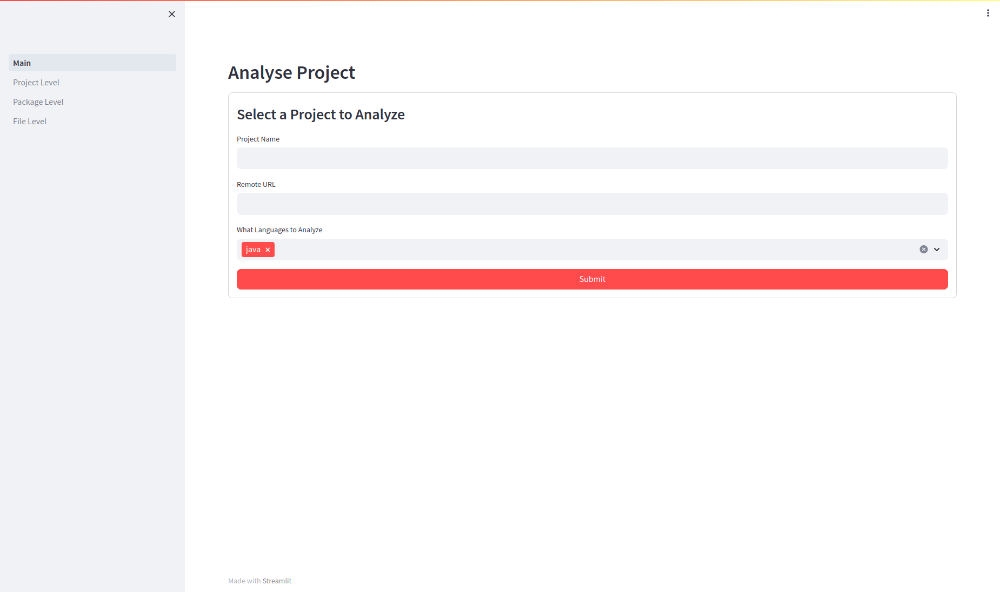
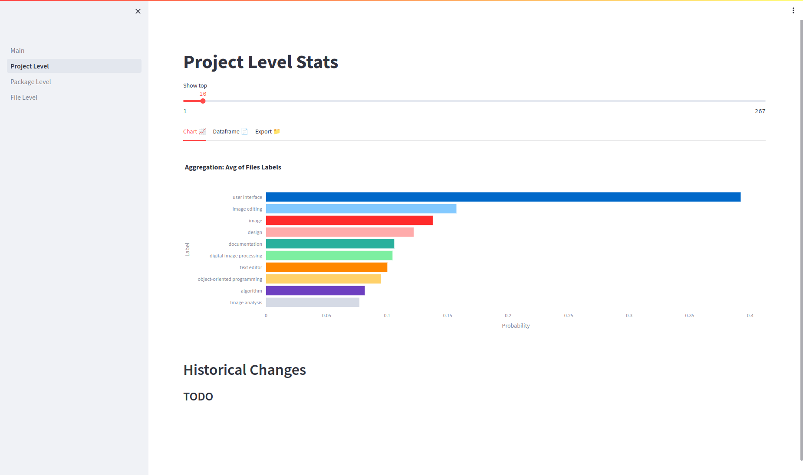
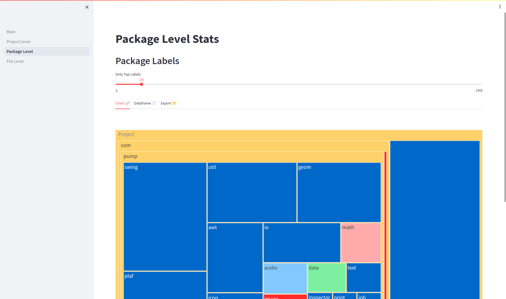
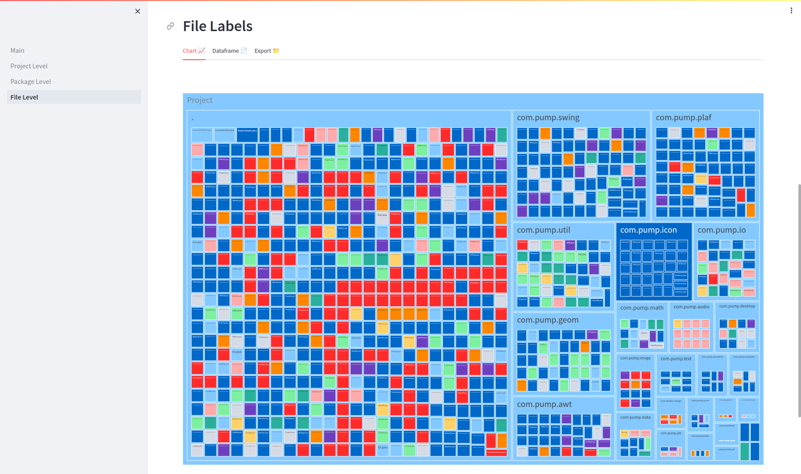

# autofl-ui

## UI Showcase

### Main Screen
<picture>
  <source media="(prefers-color-scheme: dark)" srcset="./resources/ui-screenshot/Main_dark.png">
  <source media="(prefers-color-scheme: light)" srcset="./resources/ui-screenshot/Main_white.png">
  
</picture>

### Project Screen
<picture>
  <source media="(prefers-color-scheme: dark)" srcset="./resources/ui-screenshot/Project_dark.png">
  <source media="(prefers-color-scheme: light)" srcset="./resources/ui-screenshot/Project_white.png">
  
</picture>

### Package Screen
<picture>
  <source media="(prefers-color-scheme: dark)" srcset="./resources/ui-screenshot/Package_dark.png">
  <source media="(prefers-color-scheme: light)" srcset="./resources/ui-screenshot/Package_white.png">
  
</picture>
### File Screen
<picture>
  <source media="(prefers-color-scheme: dark)" srcset="./resources/ui-screenshot/File_dark.png">
  <source media="(prefers-color-scheme: light)" srcset="./resources/ui-screenshot/File_white.png">
  
</picture>