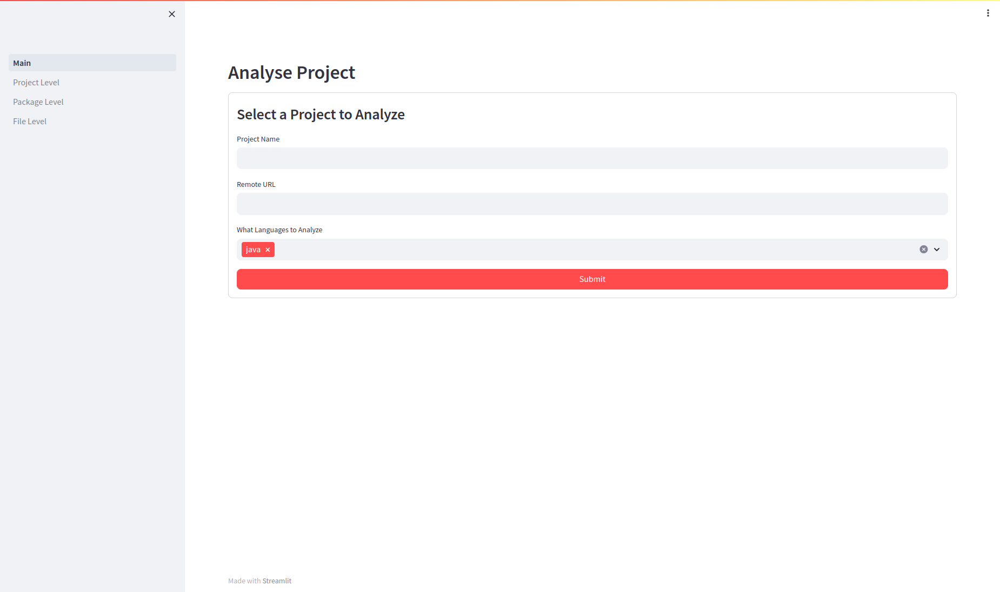
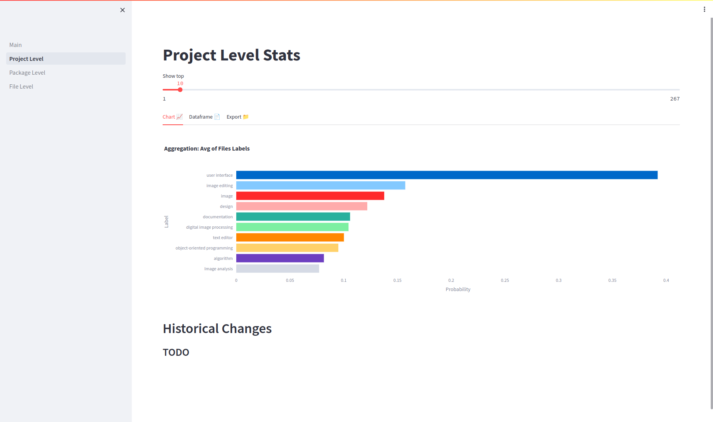
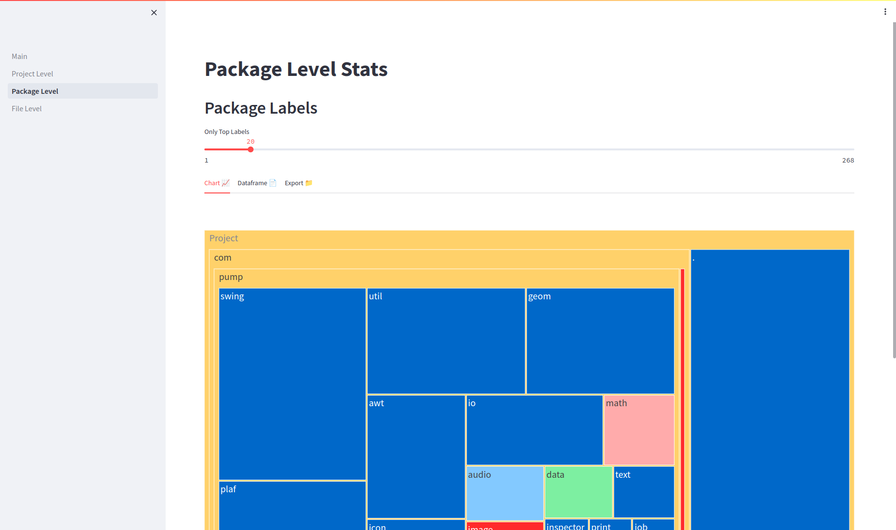
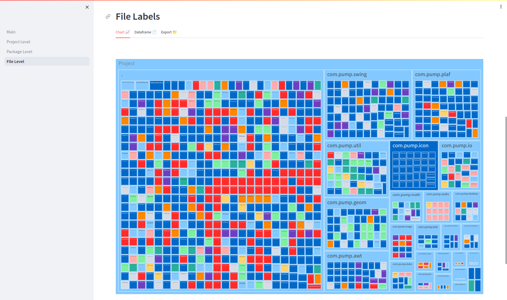

# AutoFL-UI

[](https://www.gnu.org/licenses/gpl-3.0)
[](https://zenodo.org/doi/10.5281/zenodo.10255367)
[](https://hub.docker.com/r/cezarsas/autofl-ui)

UI module for [AutoFL](https://github.com/SasCezar/AutoFL), providing a web-based interface for interacting with the AutoFL analysis tool. The UI enables users to easily visualize and explore analysis results at different granularity levels, including project, package, and file levels.

## Overview

AutoFL-UI allows users to select a project, run analyses, and interactively explore the results of the annotation process provided by AutoFL. The UI is built to enhance user experience and streamline the visualization of large-scale software annotation results.

## Docker Image Availability

AutoFL-UI is also available as a Docker image, enabling easy deployment. To use the Docker image, pull it from Docker Hub:

```shell
docker pull cezarsas/autofl-ui
```

For more details and updates, check the [Docker Hub page](https://hub.docker.com/r/cezarsas/autofl-ui).

## UI Showcase

The UI enables users to select a project for analysis, visualize the annotation results, and explore detailed views for each level of analysis: project, package, and file. Below are screenshots of the UI using the [Pumpernickel](https://github.com/mickleness/pumpernickel) project as an example.

### Main Screen

This screen allows users to select a project to analyze.

<picture>
  <source media="(prefers-color-scheme: dark)" srcset="./resources/ui-screenshot/Main_dark.png">
  <source media="(prefers-color-scheme: light)" srcset="./resources/ui-screenshot/Main_white.png">
  
</picture>

### Project Screen

The project-level view displays the top labels assigned to the entire project, sorted by their relevance.

<picture>
  <source media="(prefers-color-scheme: dark)" srcset="./resources/ui-screenshot/Project_dark.png">
  <source media="(prefers-color-scheme: light)" srcset="./resources/ui-screenshot/Project_white.png">
  
</picture>

### Package Screen

The package-level view provides labels assigned to specific packages within the project, focusing on the best labels that are also in the top project-level labels.

<picture>
  <source media="(prefers-color-scheme: dark)" srcset="./resources/ui-screenshot/Package_dark.png">
  <source media="(prefers-color-scheme: light)" srcset="./resources/ui-screenshot/Package_white.png">
  
</picture>

### File Screen

The file-level view displays the labels assigned to individual files within a package, showcasing the best label for each file.

<picture>
  <source media="(prefers-color-scheme: dark)" srcset="./resources/ui-screenshot/File_dark.png">
  <source media="(prefers-color-scheme: light)" srcset="./resources/ui-screenshot/File_white.png">
  
</picture>

## Usage

To use the UI, ensure that the AutoFL backend is running. The UI will connect to the backend to retrieve project analysis results and provide interactive visualizations.

## Disclaimer

This UI is part of the AutoFL toolset and is actively maintained. While it is functional for most cases, it may not work as expected under certain conditions. Please report any issues encountered or contribute improvements.

For more information, contact `c.a.sas@rug.nl`.
